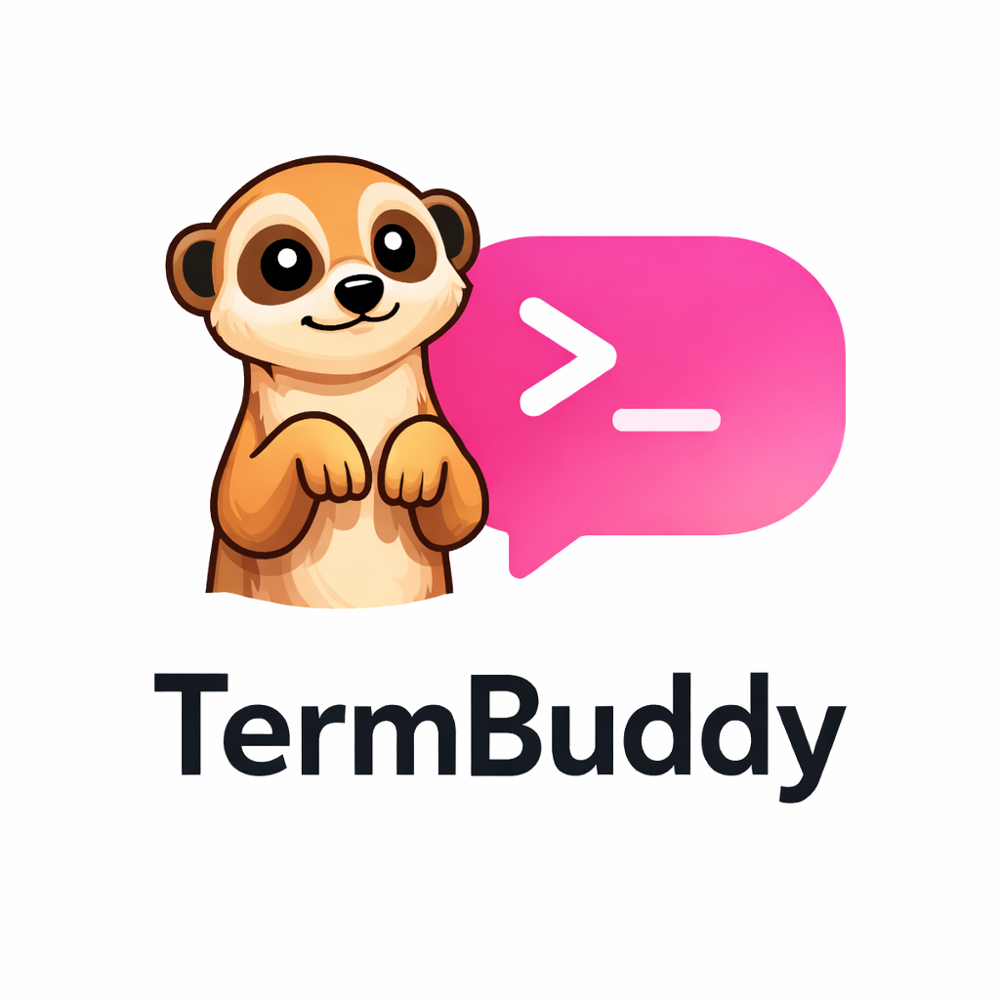
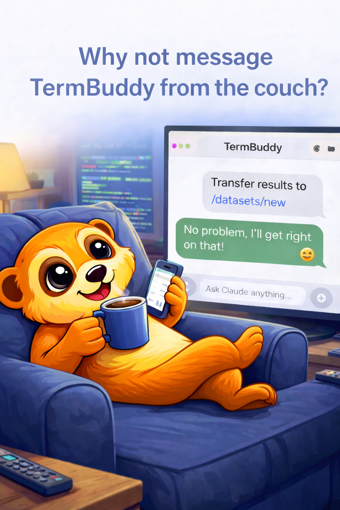
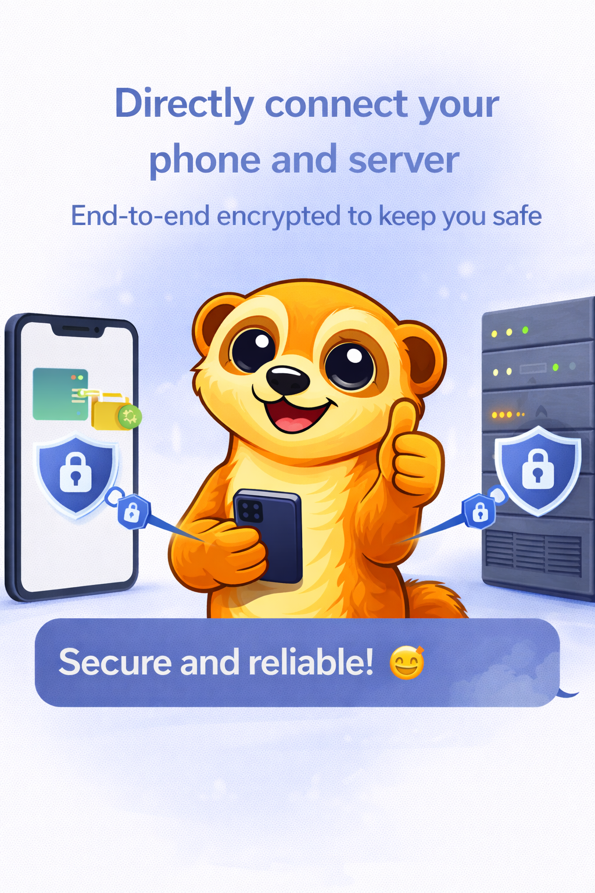
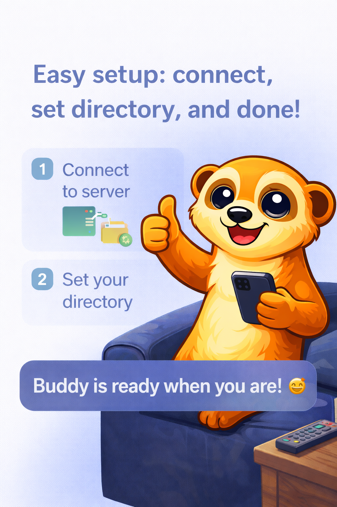

<p align="center">
  
</p>

<h1 align="center">TermBuddy</h1>
<h3 align="center">Buddy Your Terminal. Own Your Workflow.</h3>

<p align="center">
  <a href="#"></a>
  <a href="#"></a>
  <a href="#"></a>
</p>

<p align="center">
  <b>Your terminal just became your best mate.</b><br>
  Manage remote servers from your iPhone or Mac — chat with your terminal like messaging a friend.
</p>

---

<p align="center">
  
  &nbsp;&nbsp;&nbsp;
  
  &nbsp;&nbsp;&nbsp;
  
</p>

---

## Why TermBuddy?

Tired of clunky SSH apps and tiny terminal fonts on your phone? **TermBuddy reimagines the terminal as a chat conversation.** Send commands as messages, get responses as chat bubbles. Whether you're restarting a service, tailing logs, or deploying code — it feels as natural as texting.

## Key Features

### AI-Powered Terminal
Built-in support for **Claude Code**, **Codex**, and **Gemini CLI**. Ask your AI assistant to write scripts, debug errors, or explain what's happening on your server — all within the same chat interface. It's like having a senior engineer in your pocket.

<p align="center">
  
</p>

### Direct Connection. No Middleman. Fully Encrypted.
TermBuddy connects your device directly to your server — no intermediate relay, no third-party cloud. In SSH Tunnel mode, all traffic is encrypted through SSH. In Direct Connection mode, traffic is protected by TLS with certificate pinning. Your data never passes through anyone else's servers.

<p align="center">
  
</p>

### Set Up in Seconds, Not Hours
Point TermBuddy at your server, enter your SSH credentials, and tap Go. The app installs everything automatically — no manual configuration required.

<p align="center">
  
</p>

### Built for Real Workflows

| Feature | Description |
|---------|-------------|
| **Multiple Servers & Buddies** | Each Buddy handles a different task on a different server |
| **Persistent History** | Session history survives app restarts and server reboots |
| **Push Notifications** | Get notified when long-running commands finish |
| **File Browser** | Browse, upload, and download files on your server |
| **Real-Time Streaming** | Live output via Server-Sent Events (SSE) |
| **Cross-Platform** | Available on iPhone and Mac with a single subscription |

---

## How It Works

```
┌──────────────┐                      ┌──────────────────┐
│              │    SSH Encrypted      │                  │
│   iPhone /   │ ◄══════════════════► │  Your Server     │
│   Mac App    │    or TLS (HTTPS)     │  (TermBuddy      │
│              │                      │   Server - Go)   │
└──────────────┘                      └──────────────────┘
        │                                      │
   No third-party                    Binds to localhost
   servers involved                  (SSH Tunnel mode)
```

1. **Add a Server** — Enter your SSH credentials
2. **Auto-Install** — TermBuddy installs its lightweight Go server automatically
3. **Create Buddies** — Each Buddy is a persistent terminal session
4. **Chat Away** — Send commands, get results, ask AI for help

---

## Download

<p align="center">
  <a href="#">
    
  </a>
  &nbsp;&nbsp;
  <a href="#">
    
  </a>
</p>

---

## Feedback & Support

We'd love to hear from you! If you've found a bug, have a feature request, or just want to say hello:

- **Report a Bug** — [Open an Issue](https://github.com/ATLAI-TECH/TermBuddy-FeedBack/issues/new?labels=bug&template=bug_report.md)
- **Request a Feature** — [Open an Issue](https://github.com/ATLAI-TECH/TermBuddy-FeedBack/issues/new?labels=enhancement&template=feature_request.md)
- **General Discussion** — [Discussions](https://github.com/ATLAI-TECH/TermBuddy-FeedBack/discussions)

---

## FAQ

<details>
<summary><b>Does TermBuddy store my SSH credentials?</b></summary>
<br>
All credentials are stored securely in the system Keychain on your device. They are never transmitted to any third-party server.
</details>

<details>
<summary><b>What does the TermBuddy server install on my machine?</b></summary>
<br>
A lightweight Go binary (~15MB) that manages terminal sessions and communicates with the app. It runs under your user account and binds to localhost by default.
</details>

<details>
<summary><b>Do I need to open any ports?</b></summary>
<br>
No. In SSH Tunnel mode, TermBuddy uses your existing SSH connection (port 22). No additional ports need to be opened.
</details>

<details>
<summary><b>Which AI providers are supported?</b></summary>
<br>
Claude Code, Codex, and Gemini CLI. You bring your own API keys — TermBuddy never sees them.
</details>

<details>
<summary><b>Is it available on iPad?</b></summary>
<br>
Currently available on iPhone and Mac. iPad support is on the roadmap.
</details>

---

<p align="center">
  
  <br><br>
  <b>Stop wrestling with terminals. Start chatting with them.</b>
  <br>
  <sub>Made with care by <a href="https://github.com/ATLAI-TECH">ATLAI Technology</a></sub>
</p>
